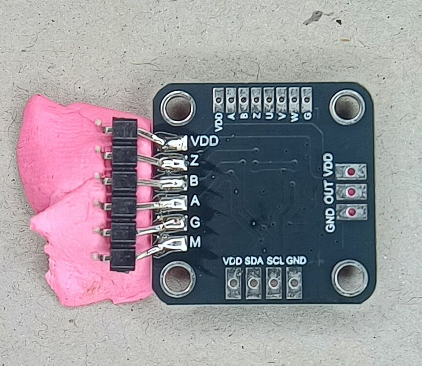
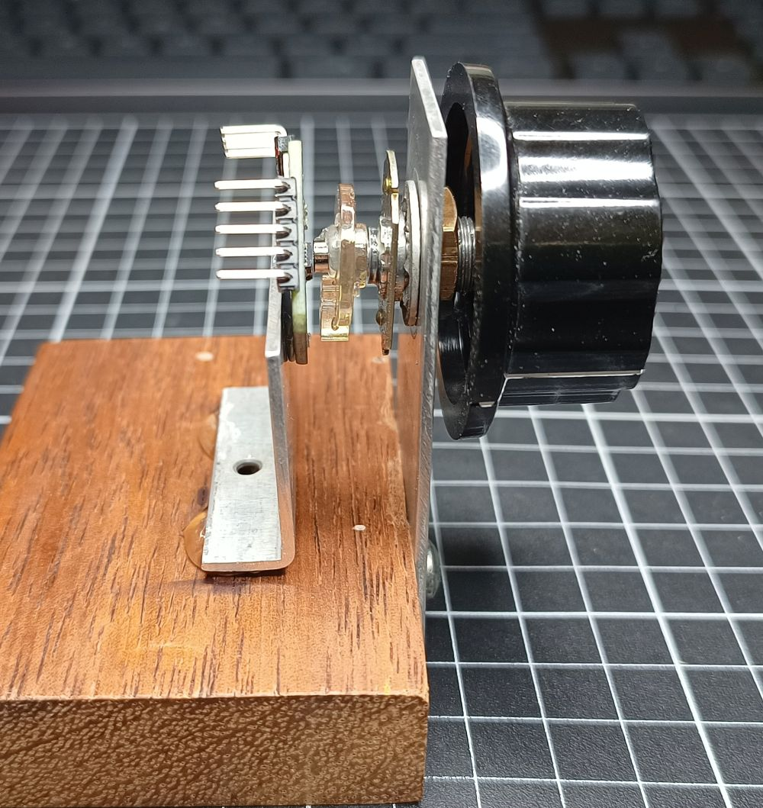

# MT6701 EEPROM Programmer for Arduino

Program the AB quadrature resolution of the MT6701 magnetic rotary encoder via I2C using an Arduino Nano or Uno.

Further information about this project is available at [Replacing a Rotary Encoder with a Magnetic Sensor and Potentiometer](https://garrysblog.com/2025/10/16/replacing-a-rotary-encoder-with-a-magnetic-sensor-and-potentiometer/).

## Overview

The MT6701 is a magnetic rotary position sensor that can output quadrature encoder signals (ABZ). This Arduino sketch allows you to change the AB resolution (pulses per revolution) stored in the MT6701's EEPROM without needing proprietary programming tools.

**Features:**
- ✅ Program AB resolution from 1 to 1024 PPR
- ✅ Preserves Z pulse width settings
- ✅ Read-only mode for safe configuration viewing
- ✅ I2C bus scanner for troubleshooting

An MT6701 module with pin headers for programming and encoder use.



An MT6701 module programmed and paired with a knob and parts from a potentiometer.



## Hardware Requirements

### Components
- **Arduino Nano or Uno** (5V version required for EEPROM programming)
- **MT6701 sensor module**
- **Magnet** (Ø6mm x 2.5mm usually comes supplied with module)

### Wiring Diagram

```
MT6701 QFN-16          Arduino Nano
─────────────          ────────────
Pin 13 (VDD)    ──────> 5V
Pin 16 (GND)    ──────> GND
Pin 14 (MODE)   ──────> Leave unconnected
Pin 6  (A or SDA)  ──────> A4 (SDA)
Pin 7  (B or SCL)  ──────> A5 (SCL)
Pin 8  (Z)      ──────> Leave unconnected
```

**⚠️ Important Notes:**
- VDD must be **>4.5V** for EEPROM programming (Arduino 5V is perfect)
- MODE pin should be **left unconnected** (has internal pull-up that enables I2C)

## Software Requirements

- **Arduino IDE** 1.8.0 or newer
- **Board:** Arduino Nano or Uno
- **Libraries:** Wire (built-in)

## Installation

1. Clone or download this repository
2. Open `MT6701_Programmer.ino` in Arduino IDE
3. Connect your Arduino Nano/Uno via USB
4. Select the correct board and port in Arduino IDE

## Usage

### Step 1: Configure Settings

Open the sketch and set your desired resolution:

```cpp
// Set your desired AB resolution here (1-1024 PPR)
#define DESIRED_AB_PPR 64

// Operating mode - Change this value:
//   false = READ ONLY (safe - just displays current settings)
//   true  = PROGRAM EEPROM (CAUTION - writes to EEPROM)
#define ENABLE_PROGRAMMING false
```

**Common Resolution Values:**
- `24` - Low resolution, suitable for user interfaces
- `64` - Medium resolution
- `100` - Common industrial encoder standard
- `200` - High resolution
- `360` - One pulse per degree
- `1000` - Very high resolution
- `1024` - Maximum resolution (4096 steps with 4x decoding)

### Step 2: Read Current Configuration

Before programming, check the current settings:

1. Ensure `ENABLE_PROGRAMMING = false`
2. Upload the sketch
3. Open Serial Monitor (9600 baud)
4. You should see:
   ```
   MT6701 detected successfully!
   
   === Current Configuration ===
     AB Resolution: 1 PPR
     Z Pulse Width: 1 LSB
   ```

### Step 3: Program New Resolution

1. Set `DESIRED_AB_PPR` to your target value
2. Set `ENABLE_PROGRAMMING = true`
3. Upload the sketch
4. Monitor the programming process in Serial Monitor
   ```
   === Starting Programming Sequence ===
   Programming complete.
   ========================================
   ```

### Step 4: Verify New Settings

**⚠️ IMPORTANT:** Power cycle required to confirm changes have been set!

1. **Disconnect VDD** from the MT6701 (or unplug Arduino)
2. Wait 2 seconds
3. **Reconnect power**
4. Set `ENABLE_PROGRAMMING = false`
5. Upload the sketch again
6. Verify the new resolution in Serial Monitor

## Understanding Quadrature Output

The MT6701 outputs standard quadrature encoder signals:

### Signal Format
- **A signal:** Square wave
- **B signal:** Square wave, 90° out of phase with A
- **Z signal:** Index pulse (once per revolution)

### Direction Detection
- **Counter-clockwise (CCW):** B leads A by 90°
- **Clockwise (CW):** A leads B by 90°

### Resolution Multipliers
Most encoder interfaces support edge counting:
- **1x decoding:** Count rising edges of A only → Resolution = PPR
- **2x decoding:** Count both edges of A → Resolution = 2 × PPR  
- **4x decoding:** Count all edges of A and B → Resolution = 4 × PPR (most common)

**Example:** 1000 PPR with 4x decoding = 4000 counts per revolution

## Technical Details

### EEPROM Write Endurance

The MT6701 datasheet does not specify EEPROM endurance, but typical embedded EEPROMs support 10,000 write cycles

**Recommendation:** Avoid frequent reprogramming. This tool is intended for initial configuration or occasional updates.

### Register Map

Key registers modified by this sketch:

| Address | Bits | Function | Modified? |
|---------|------|----------|-----------|
| 0x30 | [7:4] | UVW_RES (pole pairs) | ❌ Preserved |
| 0x30 | [1:0] | ABZ_RES high bits | ✅ Modified |
| 0x31 | [7:0] | ABZ_RES low byte | ✅ Modified |
| 0x32 | [6:4] | Z_PULSE_WIDTH | ❌ Preserved |

The sketch **only modifies the AB resolution bits** and preserves all other settings.

### Programming Sequence

Per MT6701 datasheet section 8.2:

1. Write configuration to registers 0x30 and 0x31
2. Write key `0xB3` to register 0x09
3. Write command `0x05` to register 0x0A
4. Wait >600ms for EEPROM write cycle (sketch uses 650ms)
5. Power cycle for changes to take effect

## Comparison with Mechanical Encoders

### Advantages of MT6701
✅ No contact bounce  
✅ Clean digital transitions  
✅ High resolution (up to 1024 PPR)  
✅ Absolute position available via I2C  
✅ No mechanical wear  
✅ User-programmable resolution  

### Disadvantages vs. Encoders with Detents
❌ No tactile feedback (smooth rotation)  
❌ No physical "clicks"  

## Pull-up Resistor Compatibility

If you're replacing a mechanical rotary encoder that used pull-up resistors:

**The MT6701 has push-pull outputs and doesn't need pull-ups**, but existing pull-ups will generally work:

| Pull-up Value | Compatibility | Notes |
|---------------|---------------|-------|
| 10kΩ - 47kΩ | ✅ Works fine | Recommended to leave in place |
| 4.7kΩ - 10kΩ | ✅ OK | Slight current increase |
| 1kΩ - 4.7kΩ | ⚠️ Marginal | Consider removing |
| Arduino internal (~20kΩ) | ✅ Works fine | Can remove in code |

**To disable Arduino internal pull-ups:**
```cpp
pinMode(encoderPinA, INPUT);  // Instead of INPUT_PULLUP
pinMode(encoderPinB, INPUT);
```

## References

- [MT6701 Datasheet (Rev 1.8)](https://www.novosns.com/enfiles/MT6701_Rev.1.8.pdf)
- [MagnTek Website](https://www.magntek.com.cn)

## License

This project is licensed under the MIT License - see the LICENSE file for details.

```
THE SOFTWARE IS PROVIDED "AS IS", WITHOUT WARRANTY OF ANY KIND
```

## Acknowledgments

- Generated with assistance from Claude AI (Anthropic)
- Thanks to the open-source Arduino community

---

**⚠️ Disclaimer:** This is an unofficial tool. Use at your own risk. Always verify settings after programming. The author is not responsible for any damage to equipment.
